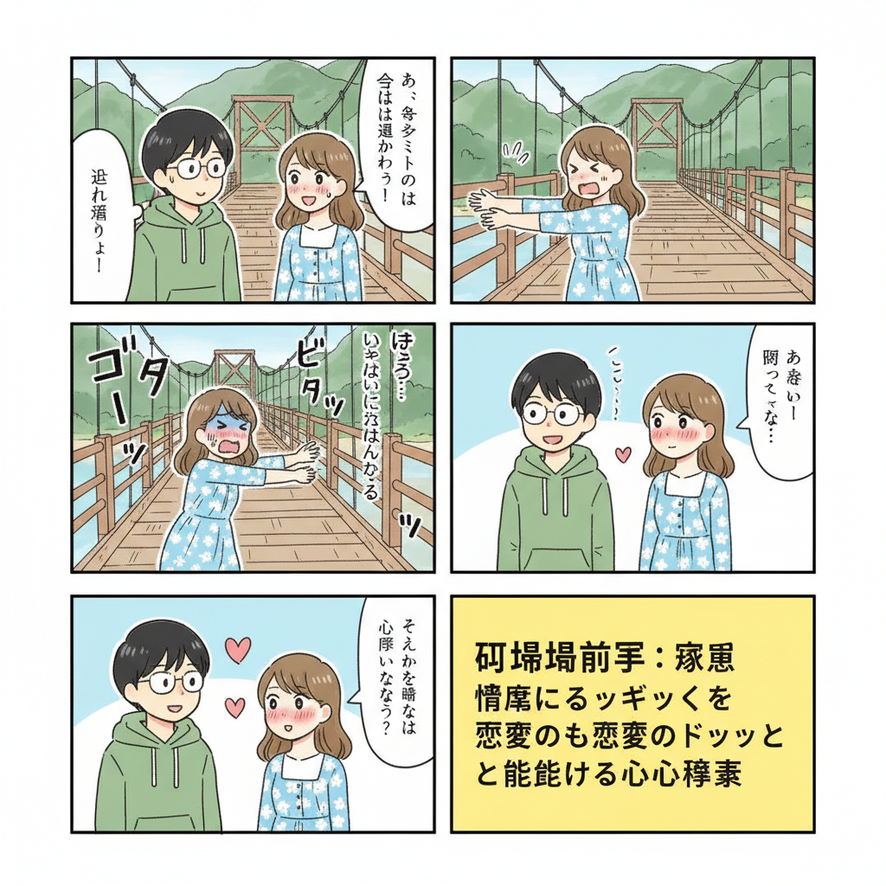
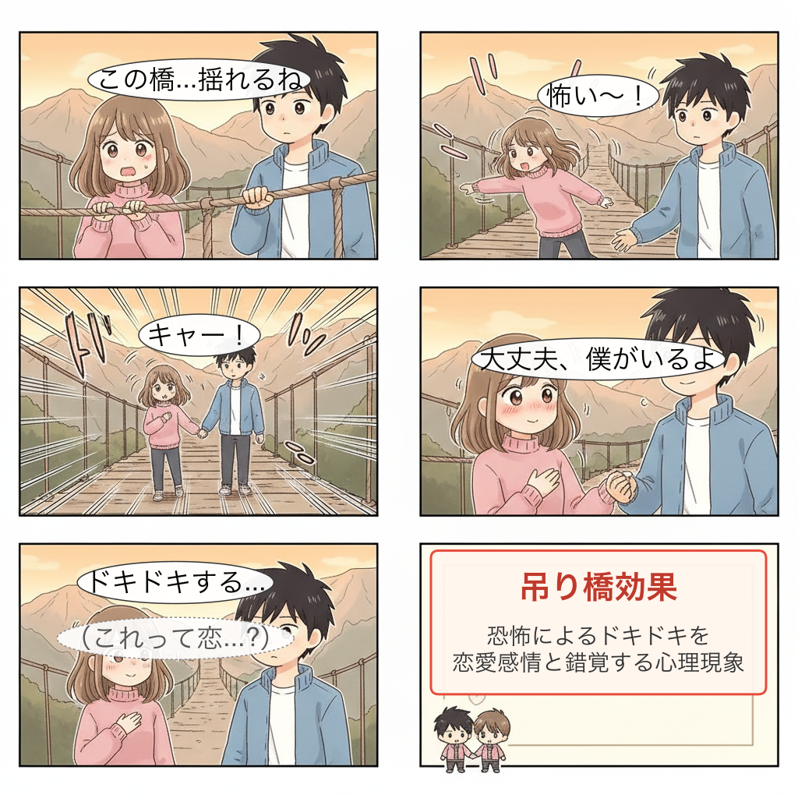

# Manga Text Overlay

Gemini AI画像生成における日本語テキスト文字化け問題を解決するNode.jsツール。

## 問題

Gemini (Nano Banana) で漫画を生成すると、日本語テキストが文字化け（中国語風の文字、読めない記号）になる問題があります。

**Before（文字化けあり）:**



**After（このツールで解決）:**



## 解決方法

「後乗せハイブリッド」アプローチ：

1. **Geminiで「テキストなし」の画像を生成**
2. **node-canvasで日本語テキストをオーバーレイ**

この方法により、100%正確な日本語テキストを漫画に追加できます。

## インストール

```bash
git clone https://github.com/YOUR_USERNAME/manga-text-overlay.git
cd manga-text-overlay
npm install
```

## 環境設定

```bash
export GEMINI_API_KEY="your-api-key-here"
```

または、スクリプト内の `apiKey` 変数を直接編集してください。

## 使い方

### 基本的な4コマ漫画生成

```bash
node scripts/generate_manga.mjs "吊り橋効果"
```

**利用可能なテーマ:**
- 吊り橋効果
- 返報性の法則
- 単純接触効果
- ミラーリング

### 長編漫画（6〜8コマ）

```bash
node scripts/generate_long_manga.mjs "ミラーリング"
node scripts/generate_long_manga.mjs "ゲインロス効果"
```

**利用可能なテーマ:**
- ミラーリング（6コマ）
- 単純接触効果（6コマ）
- 好意の返報性（6コマ）
- ゲインロス効果（8コマ）

### 出力

生成された画像は `generated_imgs/` ディレクトリに保存されます：
- `manga_base_[timestamp].png` - テキストなしのベース画像
- `manga_final_[timestamp].png` - テキスト追加済みの完成画像

## カスタマイズ

### 新しいテーマを追加

`scripts/generate_long_manga.mjs` の `themes` オブジェクトに追加：

```javascript
const themes = {
  "新しいテーマ": {
    panels: 6,  // コマ数
    prompt: `シーンの説明...`,
    dialogues: [
      { text: "セリフ1", x: 0.25, y: 0.12 },
      { text: "セリフ2", x: 0.75, y: 0.12 },
      // ...
    ]
  }
};
```

### 座標システム

- `x`: 横位置（0.0 = 左端、1.0 = 右端）
- `y`: 縦位置（0.0 = 上端、1.0 = 下端）

### 吹き出しスタイル

```javascript
{ text: "通常のセリフ", x: 0.5, y: 0.5 }
{ text: "（心の声）", x: 0.5, y: 0.5, style: "thought" }
{ text: "ナレーション", x: 0.5, y: 0.5, style: "narrator" }
```

## 技術詳細

### なぜ文字化けするのか

1. **学習データの偏り**: AIは主に英語データで学習されており、アルファベット26文字は高精度で描画可能だが、日本語（ひらがな46+カタカナ46+漢字数千）の学習データが少ない

2. **文字を「形」として描画**: AIは文字の「意味」ではなく「線と形」として描画するため、画数の多い漢字は潰れやすい

3. **中国語データの影響**: 学習データの漢字が中国語寄りのため、日本語フォントではなく中華フォント風になりやすい

### 解決アプローチの比較

| 方法 | 効果 | 自動化 |
|------|------|--------|
| プロンプト工夫（Typography/Rendering） | △ 不安定 | ○ |
| Gemini画像編集（Inpainting） | △ 不安定 | ○ |
| **テキストなし + オーバーレイ** | **◎ 確実** | **◎** |

### 使用技術

- **Gemini API** (`@google/genai`): 画像生成
- **node-canvas**: テキストオーバーレイ、吹き出し描画
- **Node.js ES Modules**: モダンなJavaScript

## ファイル構成

```
manga-text-overlay/
├── README.md
├── package.json
├── scripts/
│   ├── generate_manga.mjs      # 4コマ漫画生成
│   ├── generate_long_manga.mjs # 6〜8コマ漫画生成
│   └── generate_image.mjs      # シンプルな画像生成
├── generated_imgs/             # 生成画像の出力先
└── docs/
    ├── before.png              # 文字化けの例
    └── after.png               # 解決後の例
```

## 必要要件

- Node.js 18+
- Gemini API キー（Google AI Studio で取得）
- macOS（Hiragino フォント使用）または日本語フォントがインストールされた環境

### フォントについて

macOSでは `Hiragino Kaku Gothic Pro` を使用します。他のOSでは以下のフォントにフォールバック：
- Yu Gothic（Windows）
- Noto Sans CJK（Linux）

## ライセンス

MIT

## 参考資料

- [Nano Banana Pro 文字化け対策](https://engineer-kichizitsu.net/entry/20251209/1765250204)
- [Gemini API ドキュメント](https://ai.google.dev/gemini-api/docs)

## 既知の課題・制限事項

### 1. 吹き出し位置が顔に被る場合がある

現在、吹き出し位置は固定座標（パーセンテージ）で指定しています。Geminiが生成する画像のキャラクター位置は毎回異なるため、吹き出しが顔や重要な部分に被ることがあります。

**対策:**
- テーマ設定の `x`, `y` 座標を調整する
- 生成後に手動で位置を微調整する
- 将来的には顔検出による自動配置を検討

### 2. 誰のセリフか区別しにくい

2人のキャラクターがいる場合、どちらの発言か視覚的に区別しにくいことがあります。

**対策:**
- 吹き出しに「しっぽ」を追加して発言者を示す（実装中）
- セリフの位置を発言者に近づける
- キャラクター名を含める

### 3. レイアウトの予測不可能性

Geminiが生成するコマ割りやキャラクター配置は毎回異なります。

**対策:**
- プロンプトでレイアウトを詳細に指定する
- 複数回生成して良いものを選ぶ
- ベース画像を確認してから座標を調整する

## ロードマップ

- [ ] 顔検出による吹き出し自動配置
- [ ] 吹き出しの「しっぽ」で発言者を明示
- [ ] インタラクティブな座標調整ツール
- [ ] より多くの恋愛心理学テーマ追加
- [ ] Webインターフェース

## 貢献

Issue、Pull Request 歓迎です。
